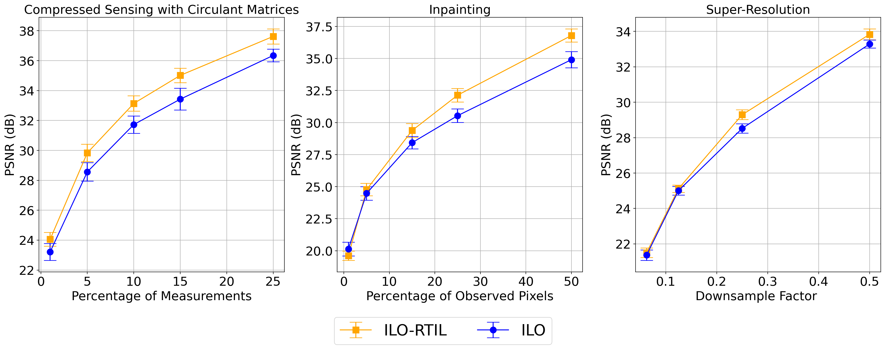
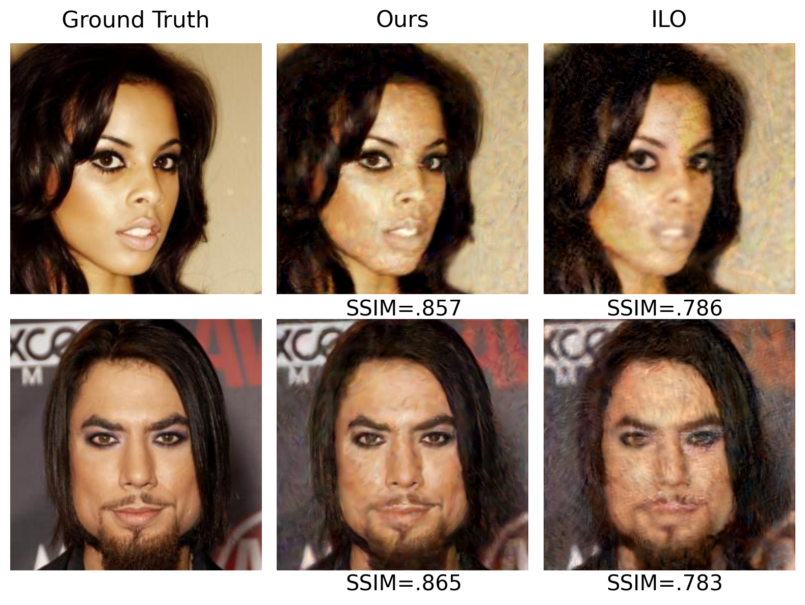
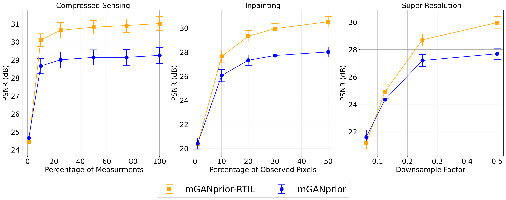
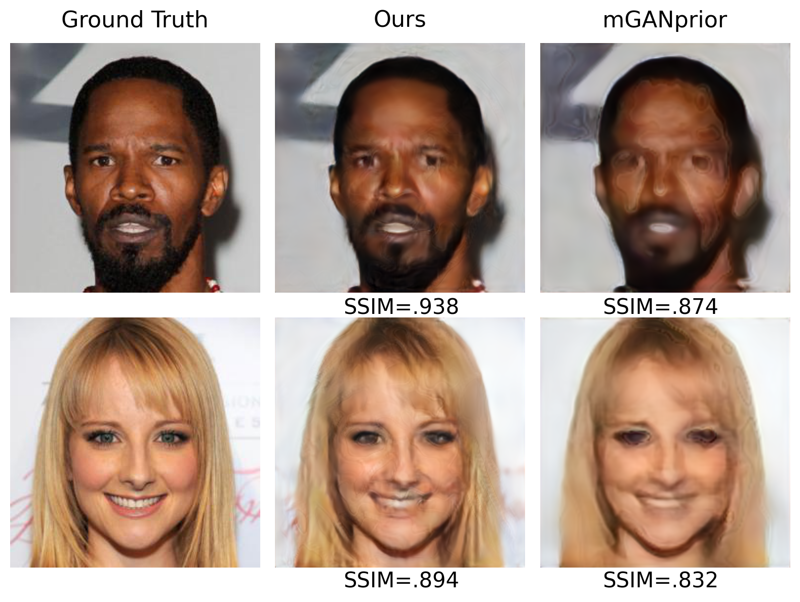

# Regularized Training of Intermediate Layers for Generative Models for Inverse Problems
#### Code to reproduce the results of the paper "Regularized Training of Intermediate Layers for Generative Models for Inverse Problems" by Sean Gunn, Jorio Cocola, and Paul Hand. 

# Abstract

#### Generative Adversarial Networks (GANs) have been shown to be powerful and flexible priors when solving inverse problems. One challenge of using them is overcoming representation error, the fundamental limitation of the network in representing any particular signal. Recently, multiple proposed inversion algorithms reduce representation error by optimizing over intermediate layer representations. These methods are typically applied to generative models that were trained agnostic of the downstream inversion algorithm. In our work, we introduce a principle that if a generative model is intended for inversion using an algorithm based on optimization of intermediate layers, it should be trained in a way that regularizes those intermediate layers. We instantiate this principle for two notable recent inversion algorithms: Intermediate Layer Optimization and the Multi-Code GAN prior. For both of these inversion algorithms, we introduce a new regularized GAN training algorithm and demonstrate that the learned generative model results in lower reconstruction errors across a wide range of under sampling ratios when solving compressed sensing, inpainting, and super-resolution problems. 

# Installation 
#### First install python dependiences by running ``` pip install -r requirements.txt```
#### Next downnload pretrained models for both ILO and mganprior
### ILO
```
cd ILO/inverse_problems/pretrained
gdown --id 1xem0Yx_sqAQLT7nAOp1KzkU2I1IjJA-W
gdown --id 1-sIeuxw1-Vgos8Yt6-TYpSUPSYNtIEFP
```
### mganprior
```
cd mganprior/inverse_problems/pretrained
gdown --id 1t3IcdeEU11EhoN-u7JijyhLtDaS77nTs
gdown --id 1U7-DHbtYzW0BgmaPKsKO7IH_YTHQjDDX
```
# Inverse Problem Demo 
#### Run Compress Sensing Demo on images from CelebAHQ

#### ILO ```cs_demo_ILO.ipynb``` 

#### mganprior ```cs_demo_mgan.ipynb```

#### Config files in both folder config.yaml

## Inverse Problem Results 
  |
| :---: |
<b> Performance of ILO-RTIL and vanilla trained ILO for Compressed sensing, inpainting, and super resolution for various under-sampling ratios.|
  
   |
| :---: |
<b> {Comparison between ILO-RTIL (ours) and ILO for compressed sensing for 3\% of measurements.|

  |
| :---: |
  <b> Performance of mGANprior-RTIL and vanilla trained mGAN for compressed sensing, inpainting, and super resolution for various under-sampling ratios.
 
  |
| :---: |
  <b> Comparison between mGANprior-RTIL (ours) and mGAN for compressed sensing for 5\% of measurements.
# Training Generative Models
#### All models are trained on [Flickr-Faces-HQ](https://github.com/NVlabs/ffhq-dataset)
#### Faces can be alligned by downloading this [file](https://drive.google.com/file/d/1mVsa7eImKyFOMtlDCbfV-rfPV_nxs9xr/view?usp=sharing) and place in ```align_faces/```  directory. To align face images, simply run ```align_faces/align_face.py``` as shown below.

```
python align_faces/align_faces.py -input {path_to_image} -output {path_to_output}
```
### ILO
```
cd ILO/train
train.py
```
### mganprior
```
cd mganprior/train
train.py
```
## Acknowledgments and License

#### We follow the StyleGAN-2 PyTorch implementation of the following repository for RTIL training ILO: https://github.com/rosinality/stylegan2-pytorch.
#### We follow the PGGAN PyTorch implementation of the following repository for RTIL training mGANprior: https://github.com/odegeasslbc/Progressive-GAN-pytorch
#### We  use the offical ILO implementation: https://github.com/giannisdaras/ilo
#### We follow the official mganprior implementation: https://github.com/genforce/mganprior
#### We thank each author for open-sourcing this implementation.


